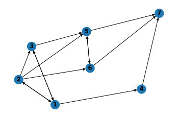
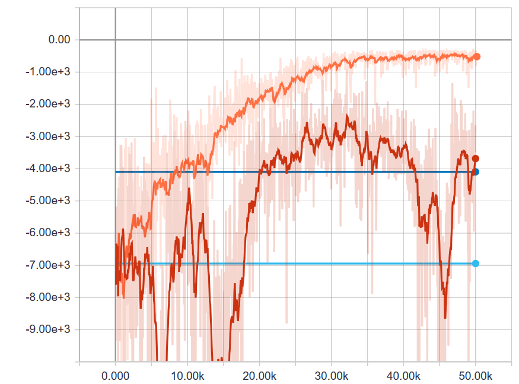
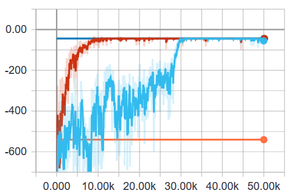

# FlowSim

FlowSim is a simple Deep Reinforcement Learning environment that simulates packet forwarding tasks from some source to a sink node via an arbitrary topology that is represented as a directed graph. FlowSim provides two primary experimental settings for the agent, i.e. whether to optimize packet forwarding with respect to hop counts or network delay.
## Example 
The ``script.py`` file provides an entrypoint to running FlowSim experiments. Here, you can specify whether rewards are attributed wrt. to hop counts or network delay, set the arrival process's specifications, the network's topologies and properties, an episode's parameters along with the agent's configuration. The following call simulates optimizing for network delay via the PPO1 RL agent:
```
python script.py --setting delay --model PPO1 
```
## Results
The network's topology is given by the following graph, where the task is to forward packets that are generated at the source (node 1) to the sink (node 7).



Here, we show the results for the PPO1 and A2C agents in comparison to the hot-potato and shortest-path routing baselines for the network delay environment. Performance is recorded over the training period for 50,000 timesteps with tensorboard. The PPO1 agent (orange) clearly outperforms the competing approaches including hot-potato (light blue) and shortest-path (blue) routing. The A2C agent (red) fails to converge successfully, but nevertheless improves upon the hot-potato baseline. 



Here, we show the results for the PPO1 and A2C agents in comparison to the hot-potato and shortest-path routing baselines for the hopcount environment. Performance is recorded over the training period for 50,000 timesteps with tensorboard. The shortest-path baseline (blue) denotes the optimal solution. While PPO1 (red) quickly matches former optimal approach, A2C (light blue) requires more iterations to converge. Hot-potato routing (orange), in comparison, performs worse than all former routing approaches. 



