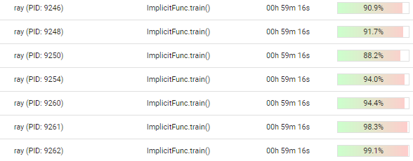
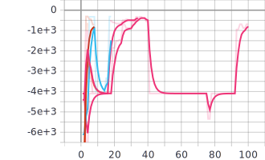
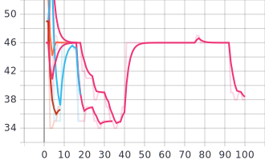
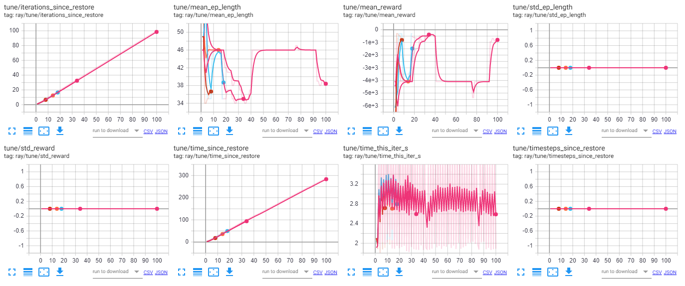

# FlowSim

### Group: Kunal, Shraddha, Stefan

FlowSim is a simple Deep Reinforcement Learning environment that simulates packet forwarding tasks from some source to a sink node via an arbitrary topology that is represented as a directed graph. FlowSim provides two primary experimental settings for the agent, i.e. whether to optimize packet forwarding with respect to hop counts or network delay.
## Example 
The ``train.py`` file provides an entrypoint to running FlowSim experiments. Here, you can specify whether rewards are attributed wrt. to hop counts or network delay, set the arrival process's specifications, the network's topologies and properties, an episode's parameters along with the agent's configuration. The following call simulates optimizing for network delay via the PPO1 RL agent:
```
python train.py --setting delay --model PPO 
```
## Results
The network's topology is given by the following graph, where the task is to forward packets that are generated at the source (node 1) to the sink (node 7).

<p align="center">
  
</p>

Here, we show the results for the PPO1 and A2C agents in comparison to the hot-potato and shortest-path routing baselines for the network delay environment. Performance is recorded over the training period for 50,000 timesteps with tensorboard. The PPO1 agent (orange) clearly outperforms the competing approaches including hot-potato (light blue) and shortest-path (blue) routing. The A2C agent (red) fails to converge successfully, but nevertheless improves upon the hot-potato baseline. 

<p align="center">

</p>

Here, we show the results for the PPO1 and A2C agents in comparison to the hot-potato and shortest-path routing baselines for the hopcount environment. Performance is recorded over the training period for 50,000 timesteps with tensorboard. The shortest-path baseline (blue) denotes the optimal solution. While PPO1 (red) quickly matches former optimal approach, A2C (light blue) requires more iterations to converge. Hot-potato routing (orange), in comparison, performs worse than all former routing approaches. 

<p align="center">

</p>

# Hyperparamer Optimization
We employ distributed (single node) Bayesian Optimization with BoTorch and Ray Tune in order to faciliate scalable hyperparameter optimization for our Reinforcement Learning agent. Specifically, we first specify a parameter search space from whom agent configurations are first sampled and subsequently evaluated. Here, Facebook's experiment library Ax is employed to schedule promising candidates. For our initial experiments we use a single node with 16 cores to distribute the optimization procedure:

<p align="center">

</p>

Optimization is invoked via the `tune.py` scipt which can be called with additional arguments, for instance:
```
python tune.py --setting delay --model PPO
```

Our preliminary results (due to time constraints) for the optimization procedure with 48 samples from the configuration's search space for the PPO agent on the default delay environment are visualized below. The left Figure illustrates the (preliminary) mean episode reward, whereas the right Figure visualizes the (preliminary) mean episode length. Besides metrics that reflect the agent's rewards, Ray Tune also logs further values that reflect other aspects of the hyperparameter search. An overview is given in the Figure beneath.

<p float="center">
  
   
</p>

<p align="center">

</p>

**Due to compatability issues we migrated from `stable_baselines` to `stable_baselines3` which implies that results will deviate from prior evaluations. 