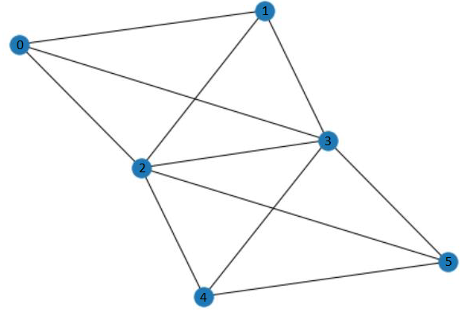

# Wireless transmission in a network with multiple collison domains and defect nodes

**Advisor**: [Haitham Afifi](https://github.com/haithamafifi)

**Developers**: [Chethan Lokesh Mariyaklla](https://github.com/mlchethanupb), [Pavitra B Gudimani](https://github.com/gudimani), [Priyanka Giri](https://github.com/pikuzz)

## Motivation 
<!-- what is the project
what is the problem and what is the solution

*the default routing protocols are vulnerable to network with defect nodes
* transmission in wireless network where each node will have a packet and they face the interference problem and here we are using the  RL what is the role of RL here.
* RL plays a role in dynamically assigning a time slot to transfer or wait for each node.
* RL also dynamically avoids a defect node in the network while transmitting the packet.
* We have merged the concept of dynamically allocating the time slot and defect node avoidance from the other paper. -->

In our work, we mainly aim to evaluate Reinforcement Learning algorithms to route the packets in the network to there respective destination by minimizing the loss of packets due some of important challenges such as signal interference, defect nodes in the network and hidden terminal problem that occur in most of the wireless communication networks. The above ideas are based on research papers [Deep-Reinforcement Learning Multiple Access for Heterogeneous Wireless Networks](https://ieeexplore.ieee.org/document/8422168) and [Deep-Reinforcement-Learning-Based QoS-Aware Secure Routing for SDN-IoT](https://ieeexplore.ieee.org/document/8935210). 

## Solution Approaches
We have three different environments to measure the performance of RL agent
* Centralized agent with no routing - The agent gives the action to transmit or wait
* Centralized agent with routing - Agent gives the routing information along with the transmit or wait
* Decentralized agent with routing - Agent gives the routing information along with the transmit or wait

## Environment Setup

### Install Conda
Install Anaconda (version 4.9.2)

### Create environment to run the project
`conda env create -f environment.yml` this will install all the prerequisits and creates an environment needed to execute the project

### Train the different agents for centralized approaches
`python training_script.py --agent='PPO2_MAC_routing` will use PPO2 for the centralized network with MAC and routing
`python training_script.py --agent='A2C_MAC_routing` will use A2C for the centralized network with MAC and routing
`python training_script.py --agent='PPO2_MAC` will use PPO2 for the centralized network with MAC alone

### To evaluate the performance of agents
`python eval_script.py` will evaluate the performance of PPO2_MAC_routing agent

### To generate the box-plots to analyse the performance
`python box.py` generates the box plot for all the agent's performance on different metrics considered

## Results and Observations

<!--## Environment Setup
We have conducted our experiments on a network topology shown in below figure.  It involves 6 nodes and 2 collision domains. Nodes (0, 1, 2, 3) are in collision domain 1, and nodes (2, 3, 4, 5) are in collision domain 2. All the nodes within collision domain 1 are connected to each other, similarly in collision domain 2. Nodes 2 and 3 will act as an intermediate node between the nodes which are not reachable from collision domain 1to collision domain 2. Defect node is chosen randomly for each episode and each node has the packet queue of size 5.

-->

## Usage Example
The network topology is given in graph format. We are using the `Networkx` library to define our topology. For example - the input for the below network can be given as [(0,1),(0,2),(0,3),(1,2),(1,3),(2,3),(2,4),(3,4),(5,2),(5,3),(5,4)]. 0, 1, 2, 3, 4 and 5 are switches/nodes in the network. Edge between nodes 0 and 1 is given as (0,1). Based on the edges between two switches the collision domain of each node will be decided. Here, 0 is connected with 1, 2 and 3. Similarly 1 is connected with 0, 2 and 3. 
Therefore, collision domain for nodes 0, 1, 2 and 3 will be same. The switches 4 and 5 are not connected directly with 0 and 1, so the collision domain of 4 and 5 will be different. Switches 2 and 3 are connected with all the other nodes in the network, therefore they are intermediate nodes.
Therefore, collision domain1 includes switches [0, 1, 2, 3] and collision domain2 includes switches [2, 3, 4, 5].

The network topology can be changed by updating graph connection data = [(0,1),(0,2),(0,3),(1,2),(1,3),(2,3),(2,4),(3,4),(5,2),(5,3),(5,4)] in `agents.ipynb`

<!--## Development Setup
The environment is developed using Python 3.7.9
Tensorflow 1.15.0
Libraries used - `gym = 0.17.3, networkx = 2.5, matplotlib = 3.3.2, stable_baselines = 2.10.1`-->

<!--## Results and Observations
The trained agent has significantly reduced the packet loss by learning to avoid collision and defect nodes while routing the packets to destination in wireless networks with multiple collision domains. The expected result of having 0 packet loss was not achieved and larger network significantly increased the packet losses.-->

<!--The below graph shows the performance of A2C over the 400000 timesteps for smaller network.
###### Reward Convergence Graph

-->

<!--###### Packet Loss Graph

-->

<!--The below graph shows the performance of A2C over the 10000000 timesteps for larger network.
###### Reward Convergence Graph

-->

<!--###### Packet Loss Graph

-->

