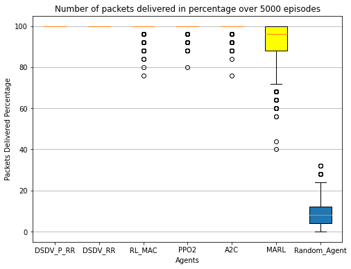
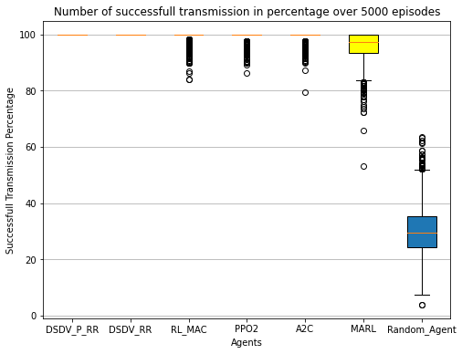
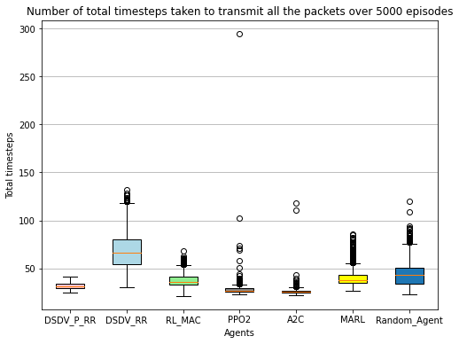
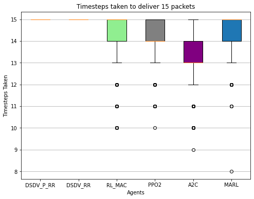
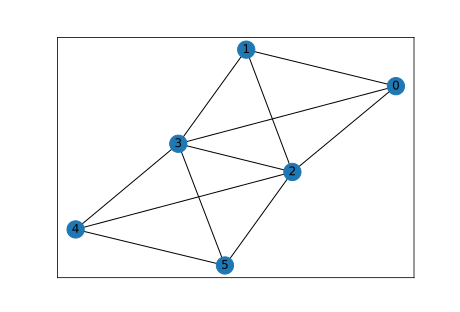
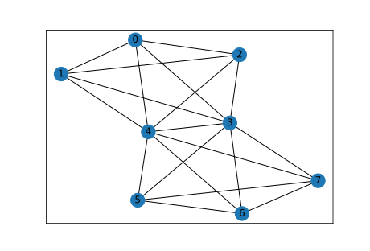
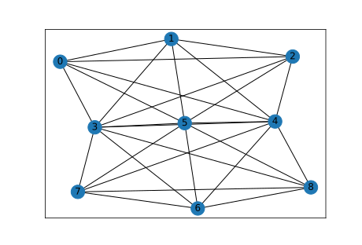
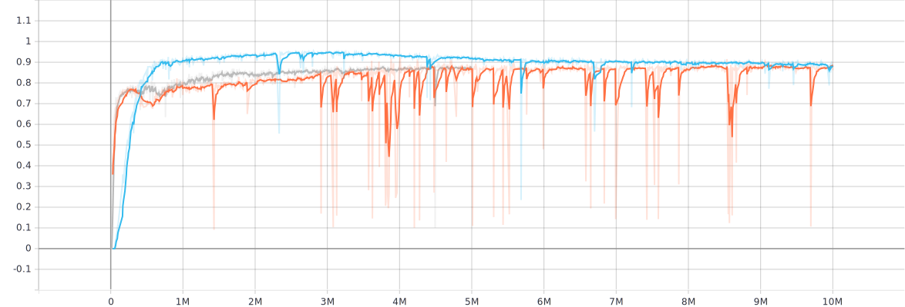
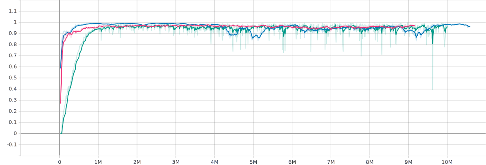

# Wireless transmission in a network with multiple collison domains and defect nodes

**Advisor**: [Haitham Afifi](https://github.com/haithamafifi)

**Developers**: [Chethan Lokesh Mariyaklla](https://github.com/mlchethanupb), [Pavitra B Gudimani](https://github.com/gudimani), [Priyanka Giri](https://github.com/pikuzz)

## Motivation 
<!-- what is the project
what is the problem and what is the solution

*the default routing protocols are vulnerable to network with defect nodes
* transmission in wireless network where each node will have a packet and they face the interference problem and here we are using the  RL what is the role of RL here.
* RL plays a role in dynamically assigning a time slot to transfer or wait for each node.
* RL also dynamically avoids a defect node in the network while transmitting the packet.
* We have merged the concept of dynamically allocating the time slot and defect node avoidance from the other paper. -->

In our work, we mainly aim to evaluate Reinforcement Learning algorithms to route the packets in the network to there respective destination by minimizing the loss of packets due some of important challenges such as signal interference, defect nodes in the network and hidden terminal problem that occur in most of the wireless communication networks. The above ideas are based on research papers [Deep-Reinforcement Learning Multiple Access for Heterogeneous Wireless Networks](https://ieeexplore.ieee.org/document/8422168) and [Deep-Reinforcement-Learning-Based QoS-Aware Secure Routing for SDN-IoT](https://ieeexplore.ieee.org/document/8935210). The performance of RL algorithms are compared with the baseline protocols of wireless networks.

## Baseline Protocols
We have implemented the baseline protocols to measure the performance of RL agents
* **DSDV with priority based round-robin MAC:** DSDV is used to fetch the routing path and  time-slot allocation for the transferring the packets is done based on round-robin mechanism and nodes with highest packets in queue are given priority. 
* **DSDV with round-robin MAC:** It uses DSDV routing protocol and time-slot allocation is based on round-robin technique.
* **Random Agent:** The approach of this agent is to take random actions to transfer the packets ineach time-step.

## RL Based Solution Approaches
We have implemented three different RL based solution approaches
* **Centralized RL agent with no routing:** A single RL agent for the entire network and decides the transmit/wait action for each of the node in the network.
* **Centralized RL agent with routing:** A single RL agent for the entire network and which gives the decision on transmit/wait action along with the routing path to transmit the packets to each nodes.
* **Decentralized RL agent with routing:** Each node acts as an agent and will decide independently to transfer the packet, including the next-hop, and whether to transfer or not in the current time-step.

## State Space
##### Centralized RL agent with no routing
* Next-hop details for each of the first packet in the node's queue
* The maximum number of packets a node can store if all packets are being transmitted to single node, that is 25.
* Defect node information

##### Centralized RL agent with routing
* Each first packet’s destination details in each node’s queue
* The maximum number of packets a node can store if all packets are being transmitted to single node, that is 25.
* Defect node information

##### Decentralized RL agent with routing
* The state space is similar to the Centralized RL agent with routing except the maximum number of packets a node can store if all packets are being transmitted to single node which is 30.

## Action Space
##### Centralized RL agent with no routing
* Transmit/wait action

##### Centralized RL agent with routing
* The action space of each agent is total number of nodes belonging to its collision domain

##### Decentralized RL agent with routing
* Similar to Centralized RL agent with routing

## Reward

##### Centralized and Decentralized RL agent with routing
* Successfull packet transmission = 1, Packet loss due to defect node, hidden terminal problem or collision reward is -1. Packet travelling via multi-hop path reward is -(0.1 × hopcounts). If an episode terminates even though queues at any node in the network has packets to transmit,then reward is = -(Number of nodes × 100 ). If all the nodes are idle reward = -1

Reward for centralized RL agent with no routing is similar except the reward due to defect node. As next-hop in this approach will not have defect node.

## Environment Setup

### Install Conda
Install Anaconda (version 4.9.2)

### Create environment to run the project
`conda env create -f environment.yml` this will install all the prerequisits and creates an environment needed to execute the project

### Train the different agents for centralized approaches
To train the different centralized agents run the script `train_centralized_agents.py`.
The different agents to train are 'PPO2_MAC_routing' or 'A2C_MAC_routing' or 'PPO2_MAC' which can be passed as an argument, the network topology to be experimented can also be passed via argument. The training of the will continue for the number of time-steps specified.

```
--agent = 'PPO2_MAC_routing' or 'A2C_MAC_routing' or 'PPO2_MAC'
--total_train_timesteps = Number of training steps for agent
--graph = '[(0, 2), (0, 1), (0, 3), (1, 2), (1, 3), (2, 3),(2, 4), (3, 4), (5, 2), (5, 3), (5, 4)]'

```

### Train the agent for decentralized approache
`train_decentralized_env.py` to train the Multi-agent RL agent.


### To evaluate the performance of centralized agent
Run the script `eval_centralized_agents.py` to evaluate the performace of centralized agents for specific evaluation episodes. This script will also evaluate the performance of baseline approaches DSDV priority based round-robin and DSDV based round-robin.
```
--agent = 'PPO2_MAC_routing' or 'A2C_MAC_routing' or 'PPO2_MAC' or 'dsdv_wqueue' or 'dsdv_RRTDMA'
--eval_episodes = Maximum number of episodes for final (deterministic) evaluation
--graph = '[(0, 2), (0, 1), (0, 3), (1, 2), (1, 3), (2, 3),(2, 4), (3, 4), (5, 2), (5, 3), (5, 4)]' should be same as used in agent's training
```

### To evaluate the performance of decentralized agent
Run `eval_decentralized_env.py` to evaluate MARL agent.
```
--agent = 'MARL'
--eval_episodes = Maximum number of episodes for final (deterministic) evaluation
--graph = '[(0, 2), (0, 1), (0, 3), (1, 2), (1, 3), (2, 3),(2, 4), (3, 4), (5, 2), (5, 3), (5, 4)]' should be same as used in agent's training
```

### To evaluate the performance of random agent
Run `eval_random_agent.py` to evaluate the performance of random agent.
```
--agent = 'random_agent'
--eval_episodes = Maximum number of episodes for final (deterministic) evaluation
--graph = '[(0, 2), (0, 1), (0, 3), (1, 2), (1, 3), (2, 3),(2, 4), (3, 4), (5, 2), (5, 3), (5, 4)]'
```

### To evaluate the performance of all the agents via box-plot
We have used the ipynb file to generate the box-plot in jupyter notebook. Run each of the cells in the file `box.ipynb`, this will generate the graph for different metrics considered in results. The metrics are plotted based on the percentage excpet for the time-steps metric.


## Results and Observations
To measure the performance of trained RL agents, we have considered metrics such as Packet delivery rate, successfull transmission rate, total timesteps taken to delivery all the packets and time steps taken to transfer fixed number of packets.


### Packet Delivery Rate
Transferring the packets from source to destination. The source and destination can be in different collision domains, hence multi-hop transfers might be required to reach from source to destination.
DSDV Baseline variants are transfering all the packets. RL_MAC (Using PPO2) without routing and centralized with routing agents (PPO2 and A2C) transfers all the packets with occassional packet loss. MARL is able to transfer 92% of the packets  which is better compared to random agent.
<p align="center">

</p>


### Successful Transmission Rate
Capability of the agent to identify the collision-free time slot to transfer the packet to the node which is present inthe same collision domain with single hop.
This metric is the measure of MAC protocol implementation. The baseline DSDV variants give 100% successfull transmission as they have dedicated time-slots to transmit. Random agent performs worst due to random actions. Centralized agent without routing (RL_MAC) and centralized agent with routing (PPO2, A2C) even though they are able to achieve 100% result, they lead to collision at some times. MARL performs better than random agent.

<p align="center">

</p>


### Time-steps for all packets
Total time taken for the agent to transfer all the packets in the network to respective destinations. This metric includes the time-steps for both successful and non-successful transmission.
Centralized agents with routing (PPO2, A2C) shows better performance than baseline variants. RL_MAC takes an average 30-40 timesteps, which is better compaared to DSDV with round-robin MAC protocol (DSDV_RR). MARL transfers more packet in less time-steps.
<p align="center">

</p>


### Time-steps for fixed packets delivery
Total time taken for the agent to transfer fixed number of packets in the network to respective destinations. This metric includes only time steps for successful packet transmission.
RL Variants are performing better than baseline variants as they are capable of transmitting 2 packets simultaneously in the different collision domain.
<p align="center">

</p>

### Scaling Results
This section is to evaluate the performance of centralized and decentralized agents over increase in number of nodes.
Increase in number of nodes increases state-space and action space for centralized agents compared to decentralized agents.
The metric considered for evaluation of two agents is value function explained variation (VF-EV).

<p align="center">
  
</p>

The above graphs shows the different networks used to evaluate the behaviour of centralized and decentralized agent with increase in number of nodes.

<p align="center">

</p>

Figure above shows the VF-EV for the centralized agent with 6(orange),8(gray) and 9(light blue) nodes. We can observe that with increase in number of nodes, time taken for convergence has also been increased. In figure, the orange line representing network with 6 nodes, value has converged around 4 million time-steps and 6 million in case of 9 nodes (light blue line).

<p align="center">

</p>

The graph above shows shows the VF-EV values for only one agent in the decentralized setup. As we can observe, behaviour of this agent has been converged well within in 1.5 million time-steps for all the networks. Also, there is only slight increase with increase in the number of nodes in network. 
With these results we can infer that decentralized agents are easily scalable when compared to that of centralized agents.


