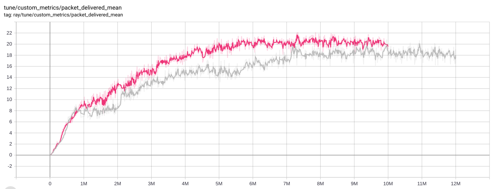

# Minutes of meeting from 2021-01-22

## Points discussed

- Add different approaches to baseline code.
	- Approach 1: Instead of weighted round robin, try with only round robin and evalaute the results. 
	- Approach 2: Node chooses to send the packet with some probability.
- Try with different type of networks (e.g - All nodes in same collision domain).
- Results for the networks can be shown in single graph plot which includes centralized, decentralized and the baseline code. 

## Action points

- Verify the result with evaluation. 
- Add graph plot discussed in the meeting in MOM, for future reference.

## Results discussed: 

- Evaluation results with trained agent:
	- Environment: Multi agent wireless network
	- Num of agents: 6 
	- Collision domains: 2
	- Attack nodes: 1
	- Number of packets per node: 5 (Total: 25)
	- Mean Packet delivered for 50000 episodes:  22.9

- Graph for reward convergence for the results of current best trained agents

- Graph for average packet delivered for the results of current best trained agents

